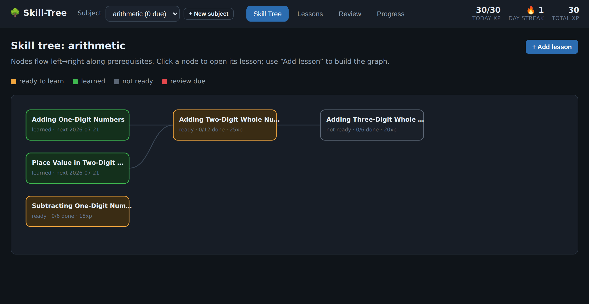

# Skill-Tree

**Learn any subject the way Math Academy teaches math.**

Skill-Tree helps you master a subject by breaking it into small lessons laid
out on a map, where each lesson unlocks only once you've learned the ones it
builds on. *You* build the lessons; Skill-Tree keeps track of what you're
ready to learn next, quizzes you on the right things at the right time so you
don't forget, and rewards steady effort with points.

It runs entirely on your own computer, in a normal web browser. Nothing is
sent anywhere — your lessons and your progress are just files on your
machine.



## What you can do

- **Build a subject visually.** Add lessons and tick which ones come first —
  Skill-Tree draws the map. No coding, no editing files by hand.
- **Write real lessons.** Each lesson is broken into small steps ("knowledge
  points"), and each step has a worked example plus a few practice problems
  you write.
- **Always know what to study.** Every lesson is colour-coded:
  🟢 learned, 🟠 ready to learn now, ⚪ locked until you finish what comes
  before it.
- **Remember what you learn.** Skill-Tree schedules reviews using *spaced
  repetition* (the idea behind flashcard apps like Anki) and mixes topics
  together in review quizzes, so knowledge sticks.
- **Prove you did the work.** Attach a photo, audio clip, video, or file as
  evidence when you finish a problem.
- **Stay motivated.** Earn XP (1 point ≈ 1 focused minute), keep a daily
  streak, and hit a daily goal.

## Getting started

You need a computer with **Python 3** — it comes pre-installed on almost all
Linux systems, so you probably already have it. That's the only requirement
for the app itself.

1. **Get the files.** Download this project (or `git clone` it) and unzip it
   somewhere, e.g. a folder called `Skill-Tree`.

2. **Open a Terminal in that folder.** (On most Linux desktops: right-click
   inside the folder → "Open Terminal Here", or open Terminal and
   `cd` into it.)

3. **Try the built-in example** to see how it all works:

   ```sh
   ./bin/st -C example web
   ```

   Your browser should open automatically. If it doesn't, open it yourself
   and go to **http://127.0.0.1:8777**. Press `Ctrl-C` in the Terminal to
   stop the app when you're done.

4. **Start your own subject.** Make a folder to hold your learning, set it
   up once, and launch the app pointed at it:

   ```sh
   mkdir my-learning
   ./bin/st -C my-learning init
   ./bin/st -C my-learning web
   ```

   From now on, just run that last line to open your learning again.

> Tip: if you'd rather type `st` instead of `./bin/st`, run
> `export PATH="$PWD/bin:$PATH"` in the Terminal first (that shortcut lasts
> until you close the window).

## Building your first subject

Everything below happens by clicking in the browser.

1. **Create a subject.** Click **➕ New subject** at the top and give it a
   name (e.g. `spanish`, `music-theory`).
2. **Add your first lesson.** Click **➕ Add lesson** and fill in the form:
   - a short **id** (like `note-names`) and a **title**;
   - a **time estimate** (roughly how many focused minutes it takes — this
     becomes the lesson's XP);
   - **prerequisites** — tick the lessons that must be learned first (there
     are none for your very first lesson);
   - an **introduction**, then one or more **knowledge points**, each with a
     **worked example** and a list of **practice problems**.

   Click **Create lesson**.
3. **Grow the map.** Add more lessons, ticking earlier ones as
   prerequisites. Skill-Tree draws the arrows for you in the **Skill Tree**
   view. (It won't let you create an impossible loop.)
4. **Learn.** Click a 🟠 *ready* lesson, read it, and mark each practice
   problem done (optionally attaching evidence). When you finish them all,
   the lesson turns 🟢 *learned* and whatever it unlocks becomes ready.
5. **Review.** The **Review** tab shows what's due. Click **Generate quiz**
   for a short, mixed set of problems from different topics; grade how well
   each went, and Skill-Tree schedules the next review automatically.
6. **Track progress.** The **Progress** tab shows your total XP, daily
   streak, goal, and the last week at a glance.

To change or remove a lesson later, open it and use **✎ Edit lesson** or
**🗑 Delete**.

## Keeping your work safe

Your subject and your progress live inside the folder you created (e.g.
`my-learning`) as ordinary text files. Back it up like any other folder —
copy it, sync it to a cloud drive, whatever you already do.

If you're comfortable with **git**, add `--git` when you set up
(`./bin/st -C my-learning init --git`), and later run
`./bin/st -C my-learning sync -m "today's work"` to save a snapshot of your
changes with a note. This is optional.

## Generating lessons with an AI assistant

Writing every lesson by hand is a lot of work. `docs/PROMPT.md` contains a
ready-made prompt you can give an AI assistant (like Claude or ChatGPT) to
draft a batch of lessons for one area of your subject, which you then review
and import. You stay the editor-in-chief — the AI drafts, you approve.

## How it relates to The Math Academy Way

Skill-Tree ports the structure of *The Math Academy Way* — mastery learning
over a prerequisite graph — to any subject: knowledge graphs, lessons made
of scaffolded knowledge points, the ready/learned/locked statuses,
spaced-repetition review, interleaving, remedial review after repeated
slips, and XP. The adaptive placement exam is intentionally left for later
(it needs a finished graph first). See `docs/DESIGN.md` for the full
mapping.

---

## For power users and developers

Skill-Tree is built as a suite of small UNIX tools over plain-text files, so
everything the browser does is also available from the command line — and
the browser and the terminal always read and write the same files.

Run `./bin/st help` to list the tools:

| command | job |
|---|---|
| `st web` | open the browser interface (this is what most people use) |
| `st init` | set up a new learning folder (`--git` to also track history) |
| `st graph` | create / list subjects |
| `st node` | create, list, show, edit lessons |
| `st link` | add / remove prerequisite arrows |
| `st check` | validate a subject (bad links, loops) |
| `st status` | show every lesson as ready / learned / not-ready |
| `st done` | mark lesson problems complete (with optional evidence) |
| `st due` | list lessons due for review |
| `st quiz` | generate and grade interleaved review quizzes |
| `st review` | grade a review of a single lesson |
| `st xp` | totals, daily goal, streak, ledger |
| `st import` | bulk-import AI-generated lessons (see docs/PROMPT.md) |
| `st sync` | snapshot your work with git |

Every list command prints tab-separated text you can pipe into `grep`,
`awk`, or `sort`.

**Design & data format:** [docs/DESIGN.md](docs/DESIGN.md) ·
**AI lesson prompt:** [docs/PROMPT.md](docs/PROMPT.md)

### Layout

```
bin/          the st tools (one small program per job)
lib/skilltree the shared library (Python 3, standard library only)
              web.py + web/ hold the browser app (server + self-contained page)
docs/         DESIGN.md, PROMPT.md
example/      a ready-made subject (arithmetic) to explore
tests/        smoke.sh (command line) + web-smoke.sh (browser server)
```

The whole system is dependency-free (Python standard library only), the web
app makes no internet connections and bundles all its own code, and your
content and progress are plain files you fully own.
